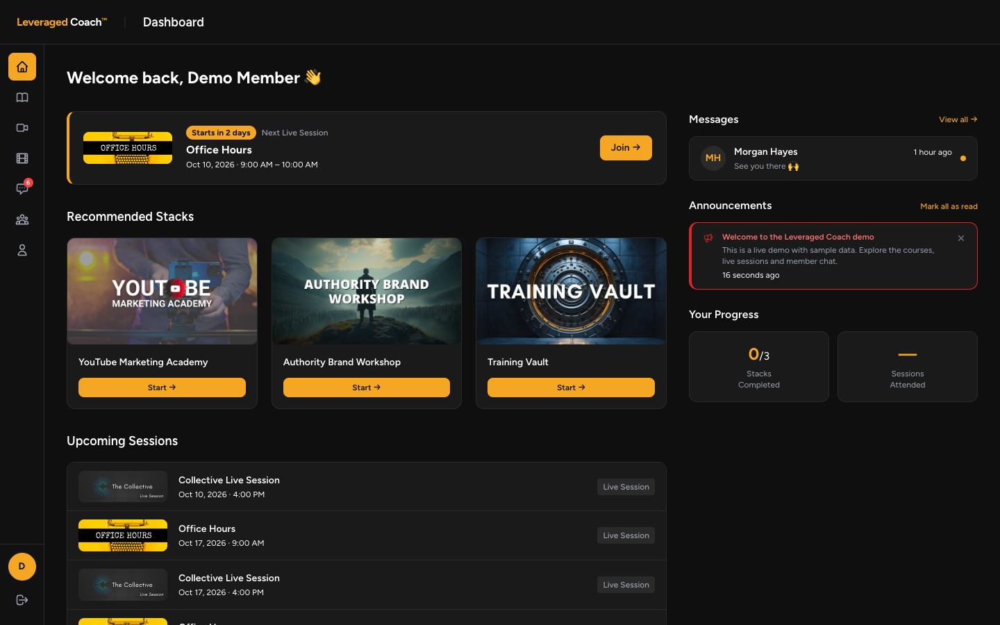
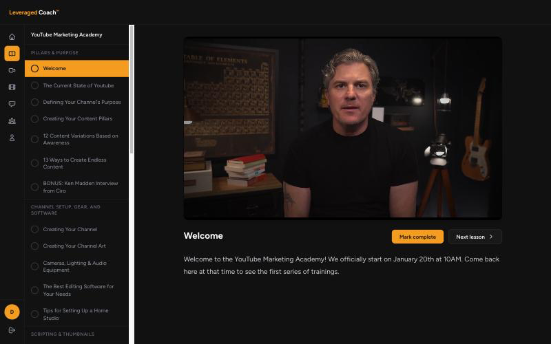
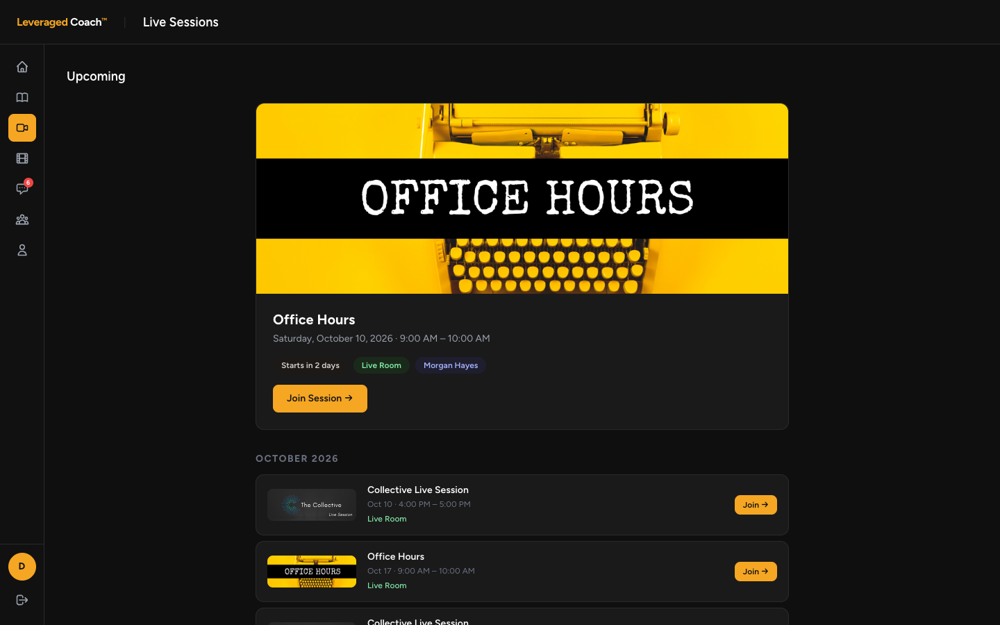
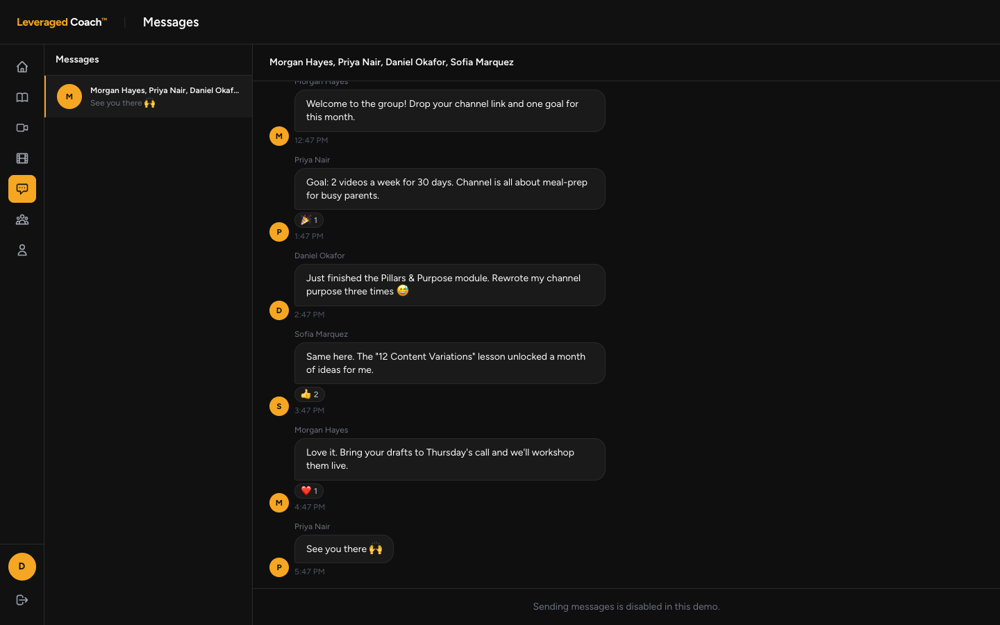
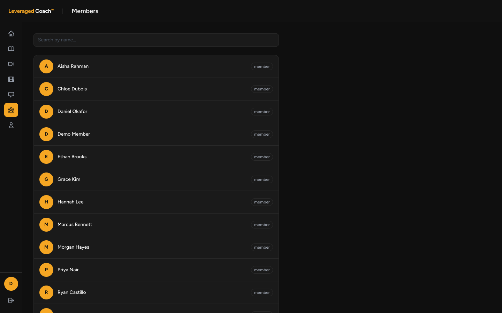

# Leveraged Coach™

A private community platform for online coaches — courses, live video sessions, recordings, member chat and group-based access control — built to replace a Circle.so subscription for a real coaching business.

**Live demo:** _coming soon_ — no sign-up needed, you're logged in as a demo member automatically.



> This is a public demo copy of the production app. Real members, private course material and API keys have been removed; the demo runs on sample data.

---

## Features

**Courses ("Stacks")**
- Courses → modules → lessons, edited on a single admin page with nested repeaters
- Lesson video from Bunny Stream, YouTube, Vimeo or MP4, plus rich-text lesson notes
- Per-lesson progress tracking, "Continue Watching", next-lesson navigation across modules

**Live sessions (Daily.co)**
- Scheduling with one-off, daily, weekly and bi-weekly recurrence (expanded virtually — no duplicate rows)
- Creating a session provisions a Daily.co room; Daily Prebuilt themed to match the app
- Cloud recording, auto-synced to Cloudflare R2 every 5 minutes and published to a Recordings library

**Community**
- Member directory, 1-on-1 and group messaging with file attachments
- Real-time chat and emoji reactions over WebSockets (Laravel Reverb)
- Dashboard with upcoming sessions, announcements and recommended courses

**Access control & payments**
- Groups gate courses, live sessions and recordings; recordings inherit their session's groups
- Stripe subscriptions and one-time offers via Laravel Cashier, with webhook-driven access grants and revocation on cancel

**Admin (Filament)**
- Manage members, groups, courses, live sessions, pricing offers and announcements

## Screenshots

| Course viewer | Live sessions |
|---|---|
|  |  |

| Messages | Members |
|---|---|
|  |  |

## Tech stack

- **Backend:** Laravel 11, PHP 8.2+
- **Frontend:** Blade, Livewire, Alpine.js, Tailwind CSS
- **Admin:** Filament v3
- **Real-time:** Laravel Reverb + Echo
- **Video:** Daily.co (live), Bunny Stream (courses), Cloudflare R2 (recordings & files)
- **Payments:** Stripe via Laravel Cashier
- **Hosting:** Laravel Forge on DigitalOcean (production)

## Run it locally

```bash
git clone https://github.com/JasontheNomad/leveraged-coach-demo.git
cd leveraged-coach-demo
composer install && npm install && npm run build
cp .env.example .env && php artisan key:generate
touch database/database.sqlite
php artisan migrate --seed
php artisan serve
```

In `.env`, set `APP_URL=http://localhost:8000` (so seeded thumbnails load) and `DEMO_USER_EMAIL=demo@example.com` to skip login and browse as the seeded demo member.

### Demo mode

When `DEMO_USER_EMAIL` is set, `app/Http/Middleware/DemoAutoLogin.php` logs every visitor in as that member and blocks profile and chat writes (visitors share one account). Joining a live session shows a placeholder instead of opening a Daily.co room. Unset it and the app behaves like production.

---

Built by Jason Stapleton.
